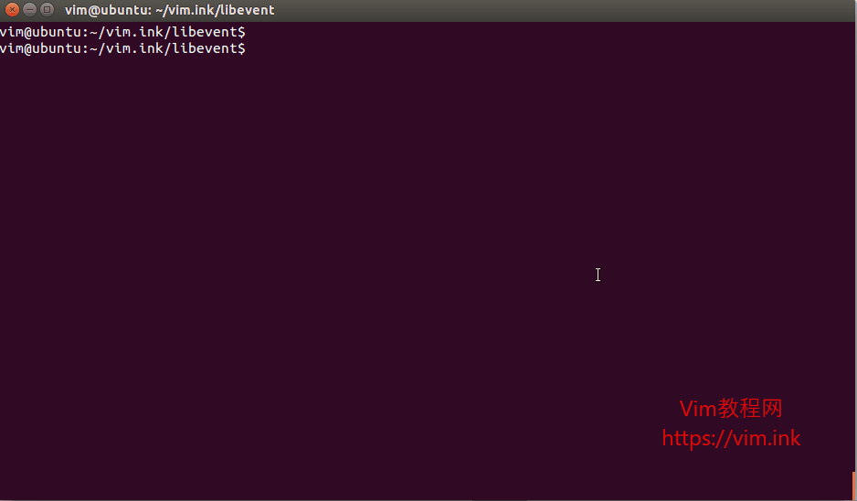
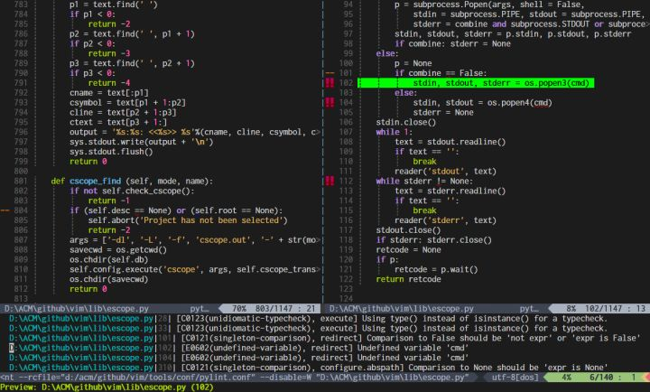

# Vim Note

## VIM IDE 打造

### 1. vimplus 下载安装

安装 vimplus：

```shell
$ git clone https://github.com/chxuan/vimplus.git ~/.vimplus
$ cd ~/.vimplus
$ ./install.sh
```

更新 vimplus：

```shell
$ ./update.sh
```

可通过 vimplus 的 `,h` 命令查看 vimplus [帮助文档](https://github.com/chxuan/vimplus/blob/master/help.md)

Ubuntu vimplus `.vimrc` 文件中有一个插件有问题，需要注释掉，插件名字如下：

```shell
Plug 'Shougo/echodoc.vim'
```

### 2. 安装 ctags

重新安装 ctags，使用 [Universal CTags](https://github.com/universal-ctags/ctags) (默认的软件源都是Exuberant Ctags，版本太旧了)

```shell
$ sudo apt install autoconf
$ cd /tmp
$ git clone https://github.com/universal-ctags/ctags
$ cd ctags
$ ./autogen.sh
$ ./configure --prefix=PATH  # 安装路径,自己的情况调整。
$ make
$ sudo make install
```

安装完毕需要在 `.vimrc` 中添加：

```shell
" 正确设置 vimrc，读取 tags（当前目录，否则向上级目录查找添加 tags）
set tags=./tags;,tags
```

这时已经可以通过在项目根目录运行 `ctags -R .` 来生成 tags 文件，就可以用了。

### 3. 安装 gtags

请首先安装最新版本 gtags，目前版本是 6.6.2，Linux 下请自行编译最新版（Debian / Ubuntu 自带的都太老了），Mac 下检查下 brew 安装的版本至少不要低于 6.6.0 ，否则请自己编译。

安装 [gtags](https://www.gnu.org/software/global/download.html) (系统软件源一般版本比较低，建议自己编译安装)

gtags 原生支持 6 种语言（C，C++，Java，PHP4，Yacc，汇编）， 通过安装 `pygments` 扩展支持 50+ 种语言（包括 go/rust/scala 等，基本覆盖所有主流语言）。

```shell
$ pip install pygments
$ sudo apt install global	# 安装gtags
```

保证 `.vimrc` 里要设置过两个环境变量才能正常工作：

```shell
" vimrc 中设置环境变量启用 pygments
let $GTAGSLABEL = 'native-pygments'
let $GTAGSCONF = '/path/to/share/gtags/gtags.conf'
```

第一个 GTAGSLABEL 告诉 gtags 默认 C/C++/Java 等六种原生支持的代码直接使用 gtags 本地分析器，而其他语言使用 pygments 模块。

第二个环境变量必须设置，否则会找不到 native-pygments 和 language map 的定义，Linux 下要到 /usr/local/share/gtags 里找，也可以把它拷贝成 ~/.globalrc ，Vim 配置的时候方便点。

实际使用 pygments 时，gtags 会启动 python 运行名为 pygments_parser.py 的脚本，通过管道和它通信，完成源代码分析，故需保证 gtags 能在 $PATH 里调用 python，且这个 python 安装了 pygments 模块。

正确安装后，可以通过命令行 gtags 命令和 global 进行测试，注意shell 下设置环境变量。

### 4. 安装三个插件

安装三个插件 : [vim-gutentags 索引自动管理](https://github.com/ludovicchabant/vim-gutentags) + [索引数据库切换](https://github.com/skywind3000/gutentags_plus) + [索引预览](https://github.com/skywind3000/vim-preview)

```shell
" 静态语法检查插件
Plug 'w0rp/ale'

" Vim自动生成 tags 插件 vim-gutentag
Plug 'ludovicchabant/vim-gutentags'
Plug 'skywind3000/gutentags_plus'
Plug 'skywind3000/vim-preview'
```

### 5. 自动生成 Gtags

使用 vim-gutentags 插件。

```shell
Plug 'ludovicchabant/vim-gutentags'
```

`.vimrc` 里加入：

```shell
" gutentags 搜索工程目录的标志，当前文件路径向上递归直到碰到这些文件/目录名
let g:gutentags_project_root = ['.root', '.svn', '.git', '.hg', '.project']

" 所生成的数据文件的名称
let g:gutentags_ctags_tagfile = '.tags'

" 同时开启 ctags 和 gtags 支持：
let g:gutentags_modules = []
if executable('ctags')
	let g:gutentags_modules += ['ctags']
endif
if executable('gtags-cscope') && executable('gtags')
	let g:gutentags_modules += ['gtags_cscope']
endif

" 将自动生成的 tags 文件全部放入 ~/.cache/tags 目录中，避免污染工程目录
let s:vim_tags = expand('~/.cache/tags')
let g:gutentags_cache_dir = s:vim_tags

" 配置 ctags 的参数，老的 Exuberant-ctags 不能有 --extra=+q，注意
let g:gutentags_ctags_extra_args = ['--fields=+niazS', '--extra=+q']
let g:gutentags_ctags_extra_args += ['--c++-kinds=+px']
let g:gutentags_ctags_extra_args += ['--c-kinds=+px']

" 如果使用 universal ctags 需要增加下面一行，老的 Exuberant-ctags 不能加下一行
let g:gutentags_ctags_extra_args += ['--output-format=e-ctags']

" 禁用 gutentags 自动加载 gtags 数据库的行为
let g:gutentags_auto_add_gtags_cscope = 0

" 检测 ~/.cache/tags 不存在就新建
if !isdirectory(s:vim_tags)
   silent! call mkdir(s:vim_tags, 'p')
endif

" 预览 quickfix 窗口 ctrl-w z 关闭
" p 预览 大p关闭
autocmd FileType qf nnoremap <silent><buffer> p :PreviewQuickfix<cr>
autocmd FileType qf nnoremap <silent><buffer> P :PreviewClose<cr>
" 往上滚动预览窗口
noremap <Leader>u :PreviewScroll -1<cr>
" 往下滚动预览窗口
noremap <leader>d :PreviewScroll +1<cr>
```

### 6. 基于 gutentags 实现跳转

在为当前目录生成tags文件后，可以通过按键 `Ctrl + ]` 跳转到对应的定义位置，再使用命令 `Ctrl + o` 回退到原来的位置。关于跳转的具体应用，可以参考 [Vim使用ctags实现函数跳转](https://vimjc.com/vim-ctag.html)



另外，建议多使用 `Ctrl + W + ]` 用新窗口打开并查看光标下符号的定义，或者 `Ctrl -W }` 使用 preview 窗口预览光标下符号的定义。

预设快捷键如下

- `<leader>cg`  - 查看光标下符号的定义
- `<leader>cs`  - 查看光标下符号的引用
- `<leader>cc`  - 查看有哪些函数调用了该函数
- `<leader>cf`  - 查找光标下的文件
- `<leader>ci`  - 查找哪些文件 include 了本文件

查找到索引后跳到弹出的 quikfix 窗口，停留在想查看索引行上，按 `小P` 直接打开预览窗口，`大P` 关闭预览。

### 7. 快速预览

我们从新项目仓库里查询了一个符号的引用，gtags 噼里啪啦的给了你二十多个结果，那么多结果顺着一个个打开，查看，关闭，再打开很蛋疼，可使用 [vim-preview](https://link.zhihu.com/?target=https%3A//github.com/skywind3000/vim-preview) 插件高效的在 quickfix 中先快速预览所有结果，再有针对性的打开必要文件：

```shell
Plug 'skywind3000/vim-preview'
```




# Reference

> [Vim配置]([http://zrainy.top/2019/08/04/Vim%E9%85%8D%E7%BD%AE/](http://zrainy.top/2019/08/04/Vim配置/))
>
> [2018 更新下vim 插件](https://cloud.tencent.com/developer/article/1336735)
>
> [Vim 8 中 C/C++ 符号索引：GTags 篇](https://zhuanlan.zhihu.com/p/36279445)
>
> [Vim自动生成tags插件vim-gutentags安装和自动跳转方法-Vim插件(10)](https://vimjc.com/vim-gutentags.html)

> [vimplus -- Github](https://github.com/chxuan/vimplus)
>
> [Vim使用笔记](https://www.cnblogs.com/jiqingwu/archive/2012/06/14/vim_notes.html)

